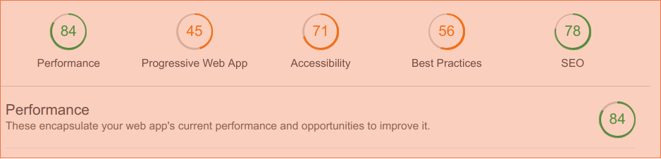

# About this Project

This is to helps us to learn how to realise a project in real situations, but will not be given to a any client. It is just an exercise from [BeCode](https://github.com/becodeorg/lovelace-2/blob/master/Projects/fil-rouge/phase-1.md)
For this, I had to create a website basing on existing [website](http://www.dynamoweb.be/dynamo_international/fr/) by creating a One-Page website.

## Client

[**Dynamo International**](http://www.dynamoweb.be/dynamo_international/fr/)

We had some source at our disposal to realise this project:

* [The briefing](https://github.com/becodeorg/lovelace-2/blob/master/Projects/fil-rouge/phase-1.md)
* [Fil rouge](https://github.com/becodeorg/lovelace-2/tree/master/Projects/fil-rouge)
* [Templates html/css](https://html5up.net/)

## Problem encouted

* For the first hour i didn't know where to start, i lost a lot of time trying to understand how everything should work because for me the website i was supposed to design was perfect.
* Usage of templates a also a new descover,i never used it before and didn't know how it works(like downloading it and extract it to get a real document to work in.)
* After having my template file, in the `index.html` file i found a lots of other languages(PHP,SASS,JS) and i din't know what i have to do with them as for my coding level i don't have any knowledge in these languages.
* By starting to work on the project,i faced onather **big problem** of making a choice of the template which can really fit with the client's datas. To this stage i spend too much time by making a choice and start working on it and finally change it... again again and again till i decide to stop and work on what i have.

##  What i learned

* Even if it tooks me too much time at least i know how to use templates.
* By dividing the task subtasks,helps me to find the final template i finally used.
* Using Lighthouse Test which is helpful.

**If i have to do the similar project i will do but i have to focus on specific thing that i want to do and because of all skills acquired from this project.**

## Lighthouse Test

Here is the resultat from Lighthouse Test:

   

Special thanks:

* [Pedro](https://github.com/pedroseromenho) (For the screenshots idea)
* [Samuel](https://github.com/SammuelJ?tab=repositories) (Clarifying how to use templates and to extract them).

# [Final resultat](https://marianeniwe.github.io/Filrouge-0-guerrilla/.)
